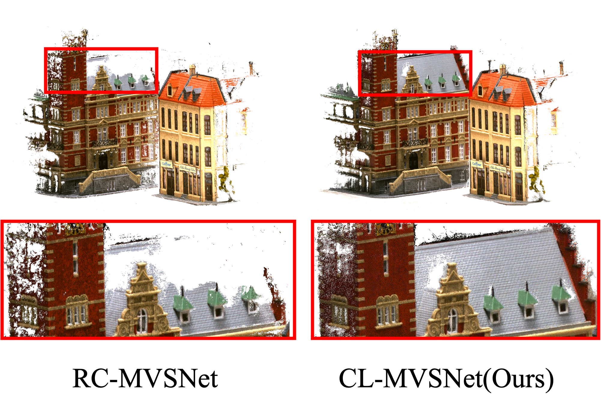

# CL-MVSNet
CL-MVSNet is an unsupervised multi-view stereo model, which integrates two contrastive branches into an unsupervised MVS framework to construct supervisory signals. Besides, an L0.5 photometric consistency loss is adopted to encourage the model to focus more on accurate points.

Details are described in our paper:
> CL-MVSNet: Unsupervised Multi-View Stereo with Dual-Level Contrastive Learning
>
> Kaiqiang Xiong, Rui Peng, Zhe Zhang, Tianxing Feng, Jianbo Jiao, Feng Gao, Ronggang Wang
>
> ICCV 2023 ([CVF](https://openaccess.thecvf.com/content/ICCV2023/papers/Xiong_CL-MVSNet_Unsupervised_Multi-View_Stereo_with_Dual-Level_Contrastive_Learning_ICCV_2023_paper.pdf))

<p align="center">
    
</p>

CL-MVSNet is more robust on the indistinguishable regions and view-dependent effects. The point cloud is more complete and accurate than previous methods.

*If there are any errors in our code, please feel free to ask your questions.*

## ⚙ Setup
#### 1. Recommended environment
- PyTorch 1.10
- Python 3.7

#### 2. DTU Dataset

**Training Data**. Download [DTU training data](https://drive.google.com/file/d/1eDjh-_bxKKnEuz5h-HXS7EDJn59clx6V/view) and [Depth raw](https://virutalbuy-public.oss-cn-hangzhou.aliyuncs.com/share/cascade-stereo/CasMVSNet/dtu_data/dtu_train_hr/Depths_raw.zip). 
Unzip them and put the `Depth_raw` to `dtu_training` folder. The structure is just like:
```
dtu_training                          
       ├── Cameras                
       ├── Depths   
       ├── Depths_raw
       └── Rectified
```
**Testing Data**. Download [DTU testing data](https://drive.google.com/file/d/135oKPefcPTsdtLRzoDAQtPpHuoIrpRI_/view) and unzip it. The structure is just like:
```
origin                          
	├── scan1                
	├── scan2   
       		├── cams
			├── 00000000_cam.txt
			├── 00000001_cam.txt
			├── ...
		├── images
			├── 00000000.jpg
			├── 00000001.jpg
			├── ...
		└── pair.txt
	├── ...
```


## 📊 Testing

#### DTU testing

**Note:** `pretrained_model/model.ckpt` is the model trained on DTU without any finetuning.

```
bash ./scripts/dtu_test.sh
```

## ⏳ Training

#### DTU training

```
bash ./scripts/dtu_train.sh
```


## ⚖ Citation
If you find our work useful in your research please consider citing our paper:
```
@inproceedings{xiong2023cl,
  title={CL-MVSNet: Unsupervised Multi-View Stereo with Dual-Level Contrastive Learning},
  author={Xiong, Kaiqiang and Peng, Rui and Zhang, Zhe and Feng, Tianxing and Jiao, Jianbo and Gao, Feng and Wang, Ronggang},
  booktitle={Proceedings of the IEEE/CVF International Conference on Computer Vision},
  pages={3769--3780},
  year={2023}
}
```

## 👩‍ Acknowledgements

Thanks to [MVSNet](https://github.com/YoYo000/MVSNet), [MVSNet_pytorch](https://github.com/xy-guo/MVSNet_pytorch), [CasMVSNet](https://github.com/alibaba/cascade-stereo/tree/master/CasMVSNet), [RC-MVSNet](https://github.com/Boese0601/RC-MVSNet) and [UniMVSNet](https://github.com/prstrive/UniMVSNet), 

